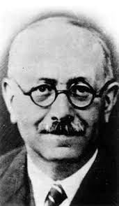
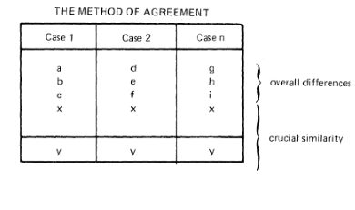
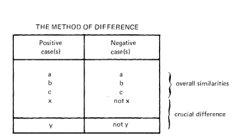
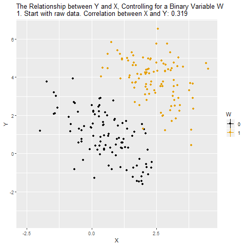
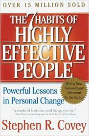

```{r setup, include=FALSE}
knitr::opts_chunk$set(echo = FALSE, warning = FALSE,
                      message = FALSE, fig.align='center', fig.retina=3,
                      out.width="75%")


```

```{r xaringan-themer, include = FALSE}
library(xaringanthemer)
style_solarized_light()
source("/Users/gabrielmesevage/Dropbox/teaching/beh-slides/helper_functions/theme_lecture.R")
xaringanExtra::use_webcam()
xaringanExtra::use_tile_view()

```

## Our plan

+ My talk today has 4 objectives

1. Introduce you to some of the literature on historical comparison, and more broadly the literature on case comparison in the social sciences
  + A very large literature, we will just dip our toes
2. Make clear to you that research methods -- like everything else -- is a *field of academic inquiry* and therefore like all fields of academic inquiry many people disagree about what is correct
3. Walk you through some thinking about comparative case studies
4. Make you practice thinking about research design

---

## Outcomes

.center[**What you should take away from this talk is the following**]

1. People care about methods and therefore you should be clear and explicit about your methods in your comparative case studies
  + Writing in history tends to be less overt about its methodological commitments. That usually makes it more readable, but you are being *explicitly asked to compare* so be explicit
2. You should *have a reason* for the cases you pick and a reason for comparing them
  + That reason should not be 'because the assignment says pick cases'
  + The reason for comparing them should not be 'because this is two examples of phenomena Y': that tells us nothing about the *purpose* of comparison

---

## Comparative history in historical perspective

+ Almost all discussion of historical comparison starts with its illustrious pedigree
  + Marx, Weber, Adam Smith, Montesquieu, Vico, Machiavelli, Polybius, Herodotus, etc
+ You'll notice some of themes names are quite old...

> "Nothing is more awkwardly old-fashioned than optimism no longer felt — in this case about the nature of social knowledge, the validity of universal laws, and the meaning of history." <br> (Grew 1980)

+ More recent comparative historical work has tended to migrate to social science departments
  + E.g. these two very famous comparative history books are both by sociologists: 
      - Moore, *Social Origins of Dictatorship and Democracy*, 1966 
      - Skocpol, *States and Social Revolutions*, 1979

---

## Historians and comparison: some reasons for resistance

1. Historians focus on mastery of archive and context
  - Comparison is at least twice as much work!
2. Since late-20th century historians increasingly resistant to generalization
  - Sometimes called the cultural/post-modern/post-structural turn
  - Although per Skocpol comparison can be *used to refute generalizations*
3. We are rightly aware of difficulties of definition

> "Are two sets of events comparable because both are called revolutions or are the crises, revolutions, and cycles assembled for analysis mere homonyms (a kind of comparison that Marc Bloch warned against), a humorless misunderstanding of a historical pun?" (Grew 1980)

+ But historians are also good at fixing this problem!
  - Pomeranz: don't compare UK (small bit of Europe) to China (big and diverse), compare like to like

> "unless state policy is the center of the story being told, the nation is not a unit that travels very well" (Pomeranz 2000).

---

## But what is the link between comparison and generalization?

.right-column[

+ Comparison invites the elucidation of causes through contrasting cases

> "L'unité de lieu n'est que désordre. Seule l'unité de problème fait centre" (The unity of place is only disorder. Only the unity of problem makes a center) (Bloch 1934).

+ An early plea for comparison by Bloch has been warmly embraced since

> "When they ply their trade most thoroughly, ...comparative historians take this maxim very seriously. Cases are selected ... according to the logic of the causal hypotheses being presented and tested. The temptation to narrate unbroken sequences of events about each time and place is resisted when this proves unnecessary for dealing with the explanatory problem at hand" (Skocpol 1980).


]

.left-column[

]

---

## Some uses of comparison (per Skocpol and Somers)


### 3 Comparative Strategies

.left-column[
1. Parallel <br>
2. Contrasting <br>
3. Macro-analytic <br>
]

.right-column[
> "What motivates the use of comparisons as opposed to focussing on single historical trajectories? What purposes are pursued - and how - through the specific modalities of *comparative* history?" (Skocpol and Somers 1980).
]

---

## 'Parallel' comparison

.pull-left[
### The logic of the strategy

> "the reason for juxtaposing case histories is to persuade the reader that a given, explicitly delineated hypothesis or theory can repeatedly demonstrate its fruitfulness" (Skocpol and Somers 1980, p. 176)

### Limitations

+ How many cases? 
+ How are they selected?
+ What is the point of comparison here?
]

.pull-right[
### Example

+ Schmuel Eisenstadt, *The Political Systems of Empires* 1963
  - Argue that a particular theory is applicable in many cases e.g. Egypt, Babylon, Incas, Aztecs, Rome, Byzantine, Ottoman empires etc.
  - Logic: 'my theory should apply to these cases. Let me demonstrate that it indeed works here.'

]


---

## Contrasting comparisons

.pull-left[
### The logic of the strategy

> Works of contrasting comparison "make use of comparative history to bring out the unique features of each particular case included in their discussions, and to show how these unique features affect the working-out of putatively general social processes" (Skocpol and Somers 1980, p. 178)

+ **This only makes sense in reaction to an argument about a process being general!**
]

.pull-right[
### Example

+ Bendix, *Kings and People*, comparative analysis used to show that

> "...authority in the name of the people has proved as *varied* in practice as the authority of kings" (emphasis in Skocpol and Somers)

+ This is only interesting insofar as you started out thinking 'political modernization' here would produce homogenous outcomes!
+ Powerful when applied to deconstruct received wisdom

]

---

## 'Macro-analytic' comparison

+ This is the framework within which comparison is a basis for causal claims
+ Two logics of causal inference here (following Mill)

.pull-left[

### Method of Agreement


]

.pull-right[
### Method of Difference


]

---

### Digression on Causation in Quantitative Work

.pull-left[

> "The logic involved in the use of comparative history ... resembles that of statistical analysis, which manipulates groups of cases to control sources of variation in order to make causal inferences..." (Skocpol and Somers 1980,p. 182).

+ Quantitative causal work can be expressed in terms of *unobservable potential outcomes*
  + E.g. the *causal effect* of your mother taking neo-natal vitamins on your height is $H^{(V=1)} - H^{(V=0)}$: **this is impossible to observe!**
+ **Strategy**: compare heights across people?
  + Problem: taking vitamins is not random, e.g. income -> vitamins
  + One solution: 'match' on income
  + OK but what about pollution...
]

.pull-right[

Source: [here](https://nickchk.com/causalgraphs.html)
]
---

.pull-left[

### Critiques: Method of Agreement

 

+ Without negative cases this is pretty weak
+ See e.g. Ashworth, Clinton, Meirowitz and Ramsay "Design, Inference, and the Strategic Logic of Suicide Terrorism" for debate about 'selecting on the dependent variable'
]

.pull-right[
### Critiques: Method of Difference

+ At its core this is finding a correlation between putative-cause and effect
  - Across how many cases?
  - How confident should we be in the conclusion?
+ Quantitative studies worry about missing explanatory variables and same risk applies here
+ What do you do if there are multiple candidate explanatory variables?
  - Quantitative studies *quantify the magnitude* of associations. In the Method of Difference all correlations for supposed causes should be 1.
]

---

.pull-left[

### Do qual/quant studies share a common causal framework?

+ King, Keohane and Verba, *Designing Social Inquiry*: "the differences between the quantitative and qualitative traditions are only stylistic and are methodologically and substantively unimportant."
  - Hugely influential methods text in political science (13,511 citations as of today!)
  - Now much repudiated, see Mahoney, "After KKV": "it seems safe to say that the field of qualitative methodology has entered a post-KKV era"
+ "What are the effects of X?" vs "What are the causes of Y?"
  - Gelman and Imbens, "Why ask Why?", 2013.
]

.pull-right[

### Some newer ideas in qualitative case studies

+ Ragin, *Fuzzy-Set Social Science*
  - Formalization of the simple logic of Mill
  - Expansion to case where variables are 'sort of' present or absent
+ Abbott, *Time Matters* or Pierson, *Politics in Time*:
  - Stress the particular temporal problems in simplistic quantitative analysis
  - Also sequence analysis (Abbott)
+ Process Tracing:
  - A fancy term popular in sociology and political science that means tracing out a causal process qualitatively
  - Can be used to generate causal mechanisms
  - Can also be used to evaluate the likelihood that a causal mechanism applies
]

+ Synthesis? Humphreys and Jacobs, "Mixing Methods: A Bayesian Approach", *American Political Science Review*, 109, 4, 2015: try to combine case-studies/quant as big Bayesian model

---

## Some practical advice

1. Start with the literature
  + Picking cases will be easier armed with a question
  + That question can come from seeking to explain a case e.g. "Why did Germany experience hyperinflation?" and then picking an appropriate comparison
2. **Talk to your seminar leaders**
  + You need their guidance both on picking good questions
  + Also on what kinds of comparative projects they are looking for
3. Don't get blinded by picking cases with common outcomes, think about common causes as well
  + E.g. "inflation is always and everywhere a monetary phenomenon" (Friedman) may suggest analyzing two cases that experience monetary expansion and see what happens to inflation
  
---

## Exercise

1. Split into groups (I will do that for you)
2. Design a question for me around joining/leaving the broader EU project
  + E.g. "What explains the accession of former USSR countries to the EU? Evidence from Poland and Ukraine" or "Why didn't Denmark choose the Euro? A comparison of Denmark and Sweden" or "Plebiscites on EU membership: a comparison of the 2016 and 1975 UK referenda". 
  + For your question, pick *two cases*
    - **Give reasons for your choices**
3. We will return to plenary and I will pick on some groups to tell me what they would do and why


---

#### Brief references (in order mentioned)

+ Raymond Grew, "The Case for Comparing Histories", *American Historical Review*, Vol. 85, No. 4, 1980.
+ Moore, *Social Origins of Dictatorship and Democracy*, 1966
+ Skocpol, *States and Social Revolutions*, 1979
+ Pomeranz, *The Great Divergence*, 2000.
+ Marc Bloch, "Une étude régionale: géographie ou histoire?", *Annales d'histoire economique et sociale*, 6, 25, 1934
+ Theda Skocpol and Margaret Somers, "The Uses of Comparative History in Macrosocial Inquiry", *Comparative Studies in Society and History*, Vol. 22, No. 2, 1980.
+ Schmuel Eisenstadt, *The Political Systems of Empires*, 1963
+ Bendix, *Kings or People: Power and the Mandate to Rule*, 1978
+ Ashworth, Clinton, Meirowitz and Ramsay "Design, Inference, and the Strategic Logic of Suicide Terrorism", *American Political Science Review*, 102, 2, 2008.
+ King, Keohane and Verba, *Designing Social Inquiry*, 1994
+ James Mahoney, "AFTER KKV: The New Methodology of Qualitative Research", *World Politics*, 62, 1, 2010.
+ Ragin, *Fuzzy-Set Social Sciencer*, 2000
+ Ragin, *The Comparative Method*, 1987 (2014)
+ Abbott, *Time Matters: On Theory and Method*, 2001
+ Pierson, *Politics in Time*, 2004
+ Gelman and Imbens, "Why ask Why? Forward Causal Inference and Reverse Causal Questions", *NBER Working Paper* 19614, 2013
+ Humphreys and Jacobs, "Mixing Methods: A Bayesian Approach", American Political Science Review, 109, 4, 2015.

